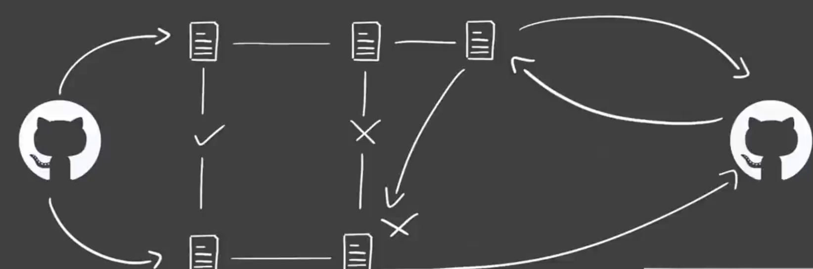
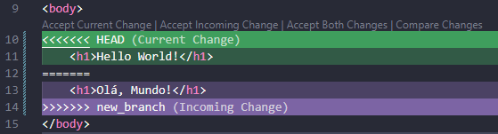

# Git e Github

**Git**: Software de versionamento de código distribuído.

**Github**: Plataforma online para armazenar e compartilhar códigos usando git.

 Por que aprender git e github?

* Controle de código

* Armazenamento em nuvem

* Trabalho em equipe

* Melhoria de código

* Reconhecimento

**GUI(Graphical User Interface) x CLI(Command line interface)**

Obs: o Git Bash é um CLI para windows

 **Revisar depois**(Comandos-Git e Comandos-Terminal-Linux)

---

## Como funciona o git

### 🧱 **Objetos Fundamentais**

O Git usa 4 tipos de objetos:

- **Blob**: conteúdo de arquivos.

- **Tree**: estrutura de pastas.

- **Commit**: aponta para uma tree + dados do autor, mensagem e commit anterior.

### 🔐 **SHA-1 e Segurança**

- Cada objeto tem um identificador único (SHA-1 40 caracteres) baseado no conteúdo.

- Isso garante **integridade dos dados** — se algo mudar, o SHA muda.

- Evita alterações maliciosas ou corrompidas.

### 🌐 **Sistema Distribuído**

- Cada pessoa tem uma cópia **completa** do repositório.

- Pode trabalhar offline e sincronizar depois.

- Operações locais são rápidas e seguras.

### 🔁 **Armazenamento de Versões**

- Git salva **snapshots completos** (e não só diferenças).

- Arquivos não modificados apontam para o mesmo blob, economizando espaço.

---

## Conflitos no Github

Um conflito de merge no Git acontece quando o software não consegue automaticamente resolver a integração de duas ou mais alterações que afetam a mesma parte de um arquivo. Isso ocorre quando diferentes branches ou versões de um projeto têm **alterações conflitantes em um mesmo trecho de código**.

#### Exemplo em código:

